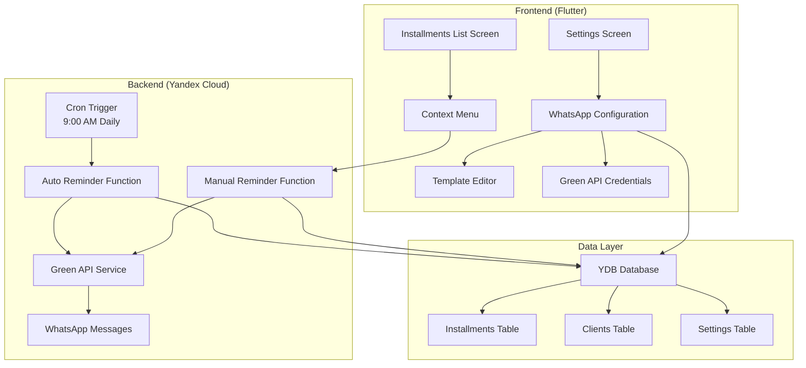

# Design Document

## Overview

The WhatsApp Reminders system integrates Green API to provide automated and manual reminder capabilities for installment payments. The system consists of backend functions for message sending, frontend UI components for configuration and manual triggers, and a settings management system for template customization and API credentials.

## Architecture

### High-Level Architecture



### Component Interaction Flow

1. **Automatic Reminders**: Cron trigger → Auto function → Database query → Green API → WhatsApp
2. **Manual Reminders**: UI context menu → Manual function → Database query → Green API → WhatsApp
3. **Configuration**: Settings UI → Database storage → Function retrieval

## Components and Interfaces

### Backend Functions

#### 1. Auto Reminder Function (`send-auto-reminders`)

**Purpose**: Processes automatic reminders triggered by cron job

**Input**:
```json
{
  "trigger_type": "cron",
  "timestamp": "2025-01-17T09:00:00Z"
}
```

**Output**:
```json
{
  "statusCode": 200,
  "processed_count": 15,
  "successful_sends": 12,
  "failed_sends": 3,
  "details": [
    {
      "installment_id": "uuid",
      "client_name": "Client Name",
      "status": "success|failed",
      "error": "error_message_if_failed"
    }
  ]
}
```

**Logic Flow**:
1. Query installments due in 7 days and today
2. For each installment, fetch client details
3. Generate personalized message using templates
4. Send via Green API
5. Log results and return summary

#### 2. Manual Reminder Function (`send-manual-reminder`)

**Purpose**: Sends immediate reminders for specific installments

**Input**:
```json
{
  "installment_ids": ["uuid1", "uuid2"],
  "user_id": "user_uuid"
}
```

**Output**:
```json
{
  "statusCode": 200,
  "results": [
    {
      "installment_id": "uuid1",
      "status": "success",
      "message_id": "green_api_message_id"
    },
    {
      "installment_id": "uuid2", 
      "status": "failed",
      "error": "Invalid phone number"
    }
  ]
}
```

### Frontend Components

#### 1. WhatsApp Settings Section

**Location**: `lib/features/settings/presentation/screens/whatsapp_settings_screen.dart`

**Components**:
- Green API credentials form (Instance ID, Token)
- Connection test button
- Template editor for different reminder types
- Variable helper display

#### 2. Context Menu Enhancement

**Location**: `lib/features/installments/widgets/installment_list_item.dart`

**Enhancement**: Add "Send WhatsApp Reminder" option to existing right-click menu

#### 3. Bulk Selection Interface

**Location**: `lib/features/installments/screens/installments_list_screen.dart`

**Components**:
- Multi-select checkboxes
- Bulk action toolbar
- Progress indicator for bulk operations

### Green API Integration Service

**Location**: `lib/core/services/whatsapp_service.dart`

**Responsibilities**:
- Green API HTTP client wrapper
- Message formatting and sending
- Error handling and retry logic
- Rate limiting compliance

## Data Models

### Settings Storage

```sql
-- New table for WhatsApp configuration
CREATE TABLE whatsapp_settings (
    user_id Utf8 NOT NULL,
    green_api_instance_id Utf8,
    green_api_token Utf8,
    reminder_template_7_days Utf8,
    reminder_template_due_today Utf8,
    reminder_template_manual Utf8,
    is_enabled Bool DEFAULT false,
    created_at Timestamp,
    updated_at Timestamp,
    PRIMARY KEY (user_id)
);
```

### Message Template Variables

**Available Variables**:
- `{client_name}`: Client's full name
- `{installment_amount}`: Monthly payment amount
- `{due_date}`: Payment due date (formatted)
- `{days_remaining}`: Days until due date
- `{product_name}`: Installment product name
- `{total_amount}`: Total installment price

**Default Templates**:
- **7-day reminder**: "Hello {client_name}, your installment payment of {installment_amount} for {product_name} is due in {days_remaining} days on {due_date}. Please prepare for payment."
- **Due today**: "Hello {client_name}, your installment payment of {installment_amount} for {product_name} is due today ({due_date}). Please make your payment."
- **Manual**: "Hello {client_name}, this is a reminder about your installment payment of {installment_amount} for {product_name}. Due date: {due_date}."

### Enhanced Installments Query

```sql
-- Query for automatic reminders
SELECT 
    i.id,
    i.product_name,
    i.monthly_payment,
    i.installment_start_date,
    i.term_months,
    c.full_name,
    c.contact_number
FROM installments i
JOIN clients c ON i.client_id = c.id
WHERE i.user_id = $user_id
AND (
    -- Due in 7 days
    DATE_ADD(i.installment_start_date, INTERVAL (EXTRACT(DAY FROM CURRENT_DATE()) - EXTRACT(DAY FROM i.installment_start_date)) + 7 DAY) = CURRENT_DATE()
    OR
    -- Due today  
    DATE_ADD(i.installment_start_date, INTERVAL (EXTRACT(DAY FROM CURRENT_DATE()) - EXTRACT(DAY FROM i.installment_start_date)) DAY) = CURRENT_DATE()
);
```

## Error Handling

### Green API Error Responses

**Common Error Scenarios**:
1. **Invalid credentials**: Return 401, disable feature
2. **Rate limiting**: Implement exponential backoff
3. **Invalid phone number**: Log and skip, continue processing
4. **Network timeout**: Retry up to 3 times
5. **API service down**: Queue messages for later retry

### Error Handling Strategy

```python
class WhatsAppError(Exception):
    def __init__(self, message, error_code=None, retryable=False):
        self.message = message
        self.error_code = error_code
        self.retryable = retryable

def send_whatsapp_message(phone, message, max_retries=3):
    for attempt in range(max_retries):
        try:
            response = green_api_client.send_message(phone, message)
            return response
        except WhatsAppError as e:
            if not e.retryable or attempt == max_retries - 1:
                raise
            time.sleep(2 ** attempt)  # Exponential backoff
```

### Frontend Error Handling

- **Connection test failures**: Show specific error messages
- **Template validation**: Real-time validation with error highlights
- **Bulk operation failures**: Show detailed results with retry options
- **Network errors**: Offline capability with queue management

## Testing Strategy

### Unit Tests

**Backend Functions**:
- Template variable substitution
- Date calculation logic
- Green API integration
- Error handling scenarios
- Database query correctness

**Frontend Components**:
- Settings form validation
- Template editor functionality
- Context menu interactions
- Bulk selection logic

### Integration Tests

**End-to-End Flows**:
- Complete automatic reminder flow
- Manual reminder sending
- Settings configuration and persistence
- Error recovery scenarios

**Green API Integration**:
- Mock Green API responses
- Rate limiting behavior
- Authentication scenarios
- Message formatting validation

### Test Data

**Mock Installments**:
- Various due dates (7 days, today, past due)
- Different client phone number formats
- Multiple installments per client
- Edge cases (missing data, invalid formats)

## Security Considerations

### Credential Storage

- Green API tokens encrypted at rest
- Environment variable injection for functions
- No credentials in client-side code
- Secure credential validation

### Phone Number Handling

- Input sanitization and validation
- International format standardization
- PII logging restrictions
- GDPR compliance for message content

### Rate Limiting

- Respect Green API rate limits
- Implement client-side throttling
- Queue management for bulk operations
- Graceful degradation under load

## Performance Optimization

### Database Queries

- Indexed queries for due date calculations
- Batch processing for multiple installments
- Connection pooling for functions
- Query result caching where appropriate

### Message Sending

- Parallel processing with concurrency limits
- Batch API calls where supported by Green API
- Asynchronous processing for bulk operations
- Progress tracking for user feedback

### Frontend Performance

- Lazy loading for settings screens
- Debounced template validation
- Optimistic UI updates
- Background sync for settings changes